<div align="center">

# 🚦 TrafficRisk-USA
### *Spatiotemporal & Environmental Intelligence for Road Safety*

[](https://python.org)
[](https://www.kaggle.com/datasets/sobhanmoosavi/us-accidents)
[]()
[]()
[]()

> **Every year, over 38,000 people die on US roads.** Most analyses ask *where* crashes happen. This project asks *why* — and *when*, *under what conditions*, and *for whom it's most dangerous*.

[Problem Statement](#-the-problem) • [Dataset](#-dataset) • [Methodology](#-methodology) • [Visualizations](#-visualization-deep-dive) • [Key Findings](#-key-findings) • [Setup](#-setup--installation) • [Usage](#-usage)

</div>

---

## 🎯 The Problem

Road accident analysis has historically been reactive — emergency responders arrive *after* crashes happen, and safety improvements come *years* after patterns are documented. The core challenge is that **accidents are not random events**. They emerge from a predictable convergence of:

- **Time** (rush hour, weekday vs. weekend, season)
- **Environment** (temperature, visibility, weather conditions)
- **Geography** (urban density, highway type, regional infrastructure)
- **Infrastructure** (signals, junctions, crossings)

Despite this, most public safety dashboards treat accidents as isolated data points. This project builds a **multi-dimensional risk intelligence system** — transforming 7.7 million raw accident records into actionable, spatiotemporal risk patterns that can inform proactive intervention.

**The question this project answers:**
> *"Given time, location, weather, and infrastructure conditions — what is the risk profile of any given road segment in the US?"*

---

## 📦 Dataset

| Attribute | Detail |
|-----------|--------|
| **Name** | US Accidents (2016–2023) |
| **Source** | Kaggle — Sobhan Moosavi et al. |
| **Volume** | ~7.7 Million Records |
| **Geographic Scope** | 49 US States |
| **Temporal Span** | February 2016 – March 2023 |
| **Core Features Used** | 15 variables across Location, Time, Environment, and Infrastructure |

**Selected Feature Dimensions:**
- 📍 **Location:** Lat, Lng, City, State
- ⏱️ **Time:** Start_Time → decomposed to Hour, Month, Weekday
- 🌤️ **Environment:** Temperature(F), Visibility(mi), Weather_Condition, Precipitation(in)
- 🛣️ **Infrastructure:** Traffic_Signal, Junction, Crossing → Hazard Score (0–3)

---

## ⚙️ Methodology

### Data Preprocessing

**Missing Value Strategy:**
- `Precipitation (~28% missing)` → Imputed as `0.0` based on the domain assumption that absent sensor readings indicate dry conditions
- Rows with missing `Start_Time`, `City`, or `Weather_Condition` were dropped entirely — justified by dataset scale ensuring no statistical bias

**Feature Engineering:**
```python
# Temporal decomposition
df['Hour']    = df['Start_Time'].dt.hour
df['Month']   = df['Start_Time'].dt.month
df['Weekday'] = df['Start_Time'].dt.day_name()

# Weather bucketing (high-cardinality → 7 groups)
weather_map = {
    'Fair': 'Clear', 'Clear': 'Clear',
    'Rain': 'Rain', 'Drizzle': 'Rain',
    'Snow': 'Snow', 'Blizzard': 'Snow',
    'Fog': 'Fog', 'Haze': 'Fog',
    'Cloudy': 'Cloudy', 'Overcast': 'Cloudy'
}

# Hazard Score: infrastructure complexity index
df['Hazard_Score'] = df['Traffic_Signal'].astype(int) + \
                     df['Junction'].astype(int) + \
                     df['Crossing'].astype(int)
```

**Analytical Techniques Used:**

| Technique | Purpose |
|-----------|---------|
| KDE Heatmaps | Geospatial severity density |
| K-Means Clustering (K=15) | Hotspot identification |
| Hierarchical Clustering | State-level accident profile similarity |
| Sankey / Alluvial Diagrams | Multi-condition flow to severity outcomes |
| Ridgeline Plots | Temporal distribution by weather type |
| Contour Mapping (2D Topographic) | Temperature × Visibility interaction surface |
| Correlation Matrix | Environmental factor independence testing |

---

## 📊 Visualization Deep Dive

### 1. Accident Frequency Heatmap — Hour × Day of Week

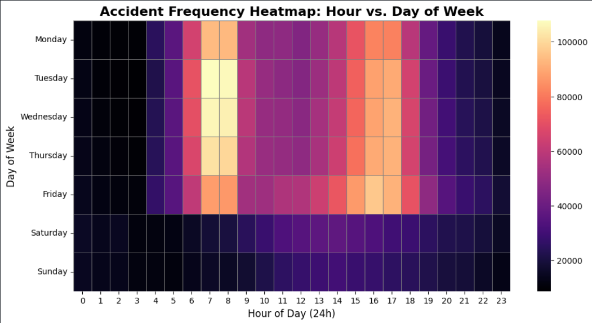

The temporal fingerprint of accidents is unmistakable. Weekday mornings (6–9 AM) and evenings (3–6 PM) are the highest-risk windows — a direct reflection of commuter activity. The bright yellow cells at **Tuesday–Thursday, 7–8 AM** represent the absolute peak: over 100,000 accidents recorded at that slot across the dataset's span. Critically, the **risk is not weather-driven** at this scale; it is **human-schedule-driven**. Weekends (Saturday–Sunday) show a dramatically flatter, lower-intensity distribution consistent with leisure travel patterns.

**Intervention implication:** Dynamic speed limit enforcement and real-time alert systems should activate specifically during the 7–9 AM and 4–6 PM weekday windows.

---

### 2. USA Accident Severity Zones — High-Risk Cluster Analysis

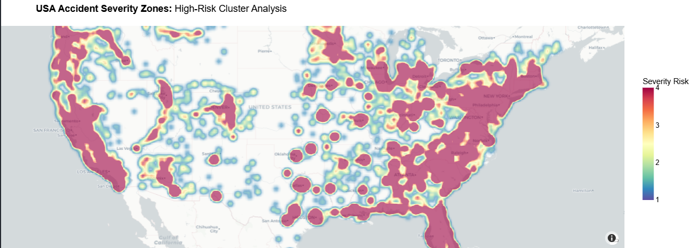

A severity-weighted KDE heatmap across the continental US reveals three structural risk zones:
- **Eastern Seaboard:** Near-continuous deep red corridor from Boston to Miami — the densest and most severe zone, driven by population concentration and interstate corridor overload
- **West Coast Corridors:** High-intensity clusters along California's I-5 and I-101, with Sacramento and Los Angeles forming distinct hotspots
- **Central Void:** Mountain West and Great Plains show dramatically lower severity density, consistent with lower population and traffic volume

The Eastern density is not just a volume problem — it represents a systemic infrastructure challenge where congestion compounds severity at every incident.

---

### 3. Weather Impact Analysis — Severity Breakdown

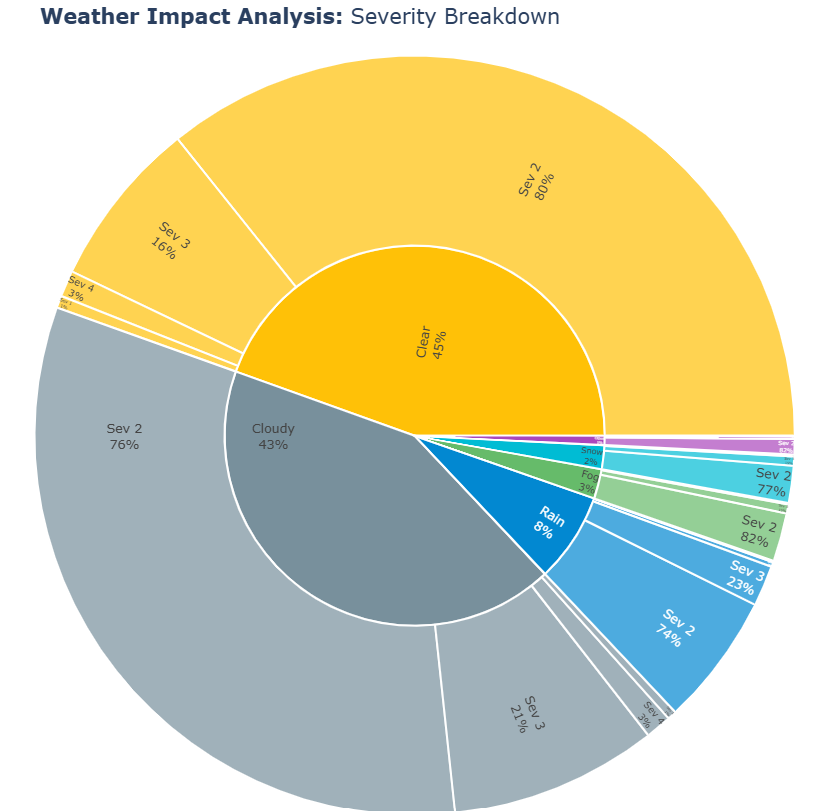

One of the most counter-intuitive findings in the dataset: **88% of accidents occur in Clear (45%) or Cloudy (43%) conditions.** Rain accounts for just 8%, while Snow and Fog together contribute only ~5%.

The inner ring shows weather type distribution; the outer ring breaks each weather segment into severity sub-slices. Severity 2 (moderate) dominates uniformly across all weather types — ranging from 74% in Rain to 82% in Fog. The takeaway is not that weather is irrelevant, but that **driver behavioral overconfidence in good conditions** poses a larger systemic risk than adverse weather itself.

---

### 4. Multi-Dimensional Risk Flow — Conditions → Severity

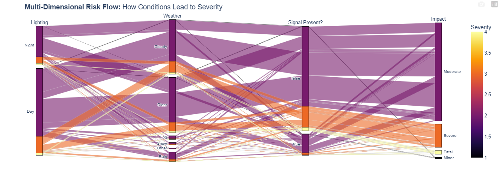

This Sankey (alluvial) diagram traces the complete causal pathway: **Lighting → Weather → Signal Presence → Impact Severity**. Flow width is proportional to accident volume; color encodes severity level from Minor (dark purple) through Fatal (yellow).

Key structural patterns:
- The widest bands originate from **"Day" + "Clear/Cloudy"** — confirming the volume finding above
- A dominant flow routes through **Signal Present: False**, indicating highways without signals generate more accidents than controlled intersections
- **"Night" lighting** disproportionately feeds into Severity 3 (Severe) and Severity 4 (Fatal) outcomes — thin bands but high consequence

---

### 5. Correlation Matrix — Environmental Factors vs. Severity

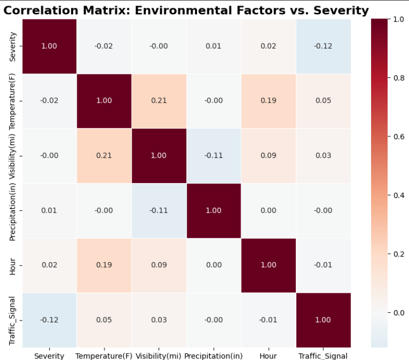

The heatmap reveals a critical analytical truth: **individual environmental variables are near-independent predictors of severity.** All correlations with Severity hover near zero — no single weather or time variable can predict accident outcome on its own.

| Variable | Correlation with Severity |
|----------|--------------------------|
| Temperature | -0.02 |
| Visibility | -0.00 |
| Precipitation | +0.01 |
| Hour | +0.02 |
| Traffic Signal | **-0.12** |

The strongest signal is `Traffic_Signal` at -0.12 — *negative* — meaning signal-equipped locations correlate with **lower** severity accidents. The moderate Temperature–Visibility correlation (0.21) reflects natural co-variation (warmer and clearer during daytime) rather than a causal accident driver. This matrix justifies the need for **multivariate interaction modeling** over simple regression.

---

### 6. Top 15 States and High-Risk Cities

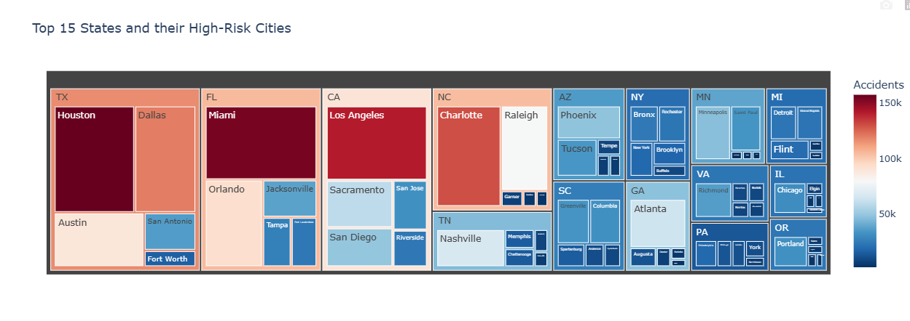

This treemap encodes state-level volume (block size) and city-level accident count (nested blocks with color intensity). Texas, Florida, and California form the undisputed "Big Three" — with Houston, Miami, and Los Angeles each exceeding 150k accidents (deep red).

Notable patterns:
- **TX and FL** concentrate risk in 2–3 cities; remaining cities are dramatically smaller
- **NC** shows a sharp Charlotte-dominant profile — one city carrying the state
- **NY** distributes across Bronx, Brooklyn, and Buffalo rather than concentrating in a single metro
- **MI and PA** have respectable state totals but no single city reaching the extreme red threshold

---

### 7. Hourly Environmental Trends vs. Accident Frequency

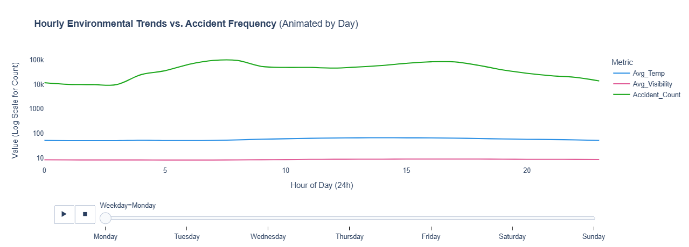

Three metrics plotted on a shared log-scale y-axis across 24 hours, animated by day of week (shown here for Monday). The result is decisive: **Avg_Temperature (blue) and Avg_Visibility (pink) remain essentially flat across all hours**, while **Accident_Count (green) shows dramatic rush-hour spikes** peaking around 8–10 AM and again at 15–17h.

This chart definitively decouples the environmental narrative from the behavioral one — daily accident cycles are driven by human activity concentration, not hourly weather fluctuations. The log scale makes the flatness of the environmental lines even more striking against the accident curve's volatility.

---

### 8. Dynamic Environmental Risk — Hourly Weather & Severity

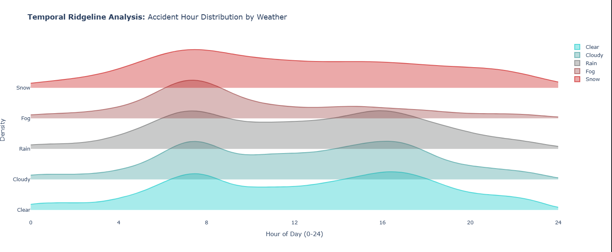

An animated 4-dimensional bubble chart (shown here at Hour=0) encoding: **Average Temperature (x-axis) × Accident Volume (y-axis, log scale) × Visibility (bubble size) × Avg Severity (color)**.

At midnight (Hour=0), weather groups cluster around 50–55°F. The large teal bubble at ~55°F represents Clear/Cloudy conditions — highest volume even at night, moderate severity. The small dark purple bubble at ~50°F represents adverse conditions — lower volume but elevated severity. As the animation progresses through daytime hours, bubbles grow (visibility improves) and volume surges, confirming the commuter-driven pattern seen in the heatmap.

---

### 9. Critical Segment Identification — K-Means Clustering (K=15 Hotspots)

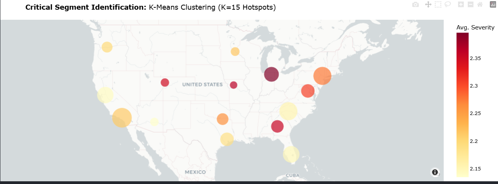

K-Means with K=15 partitions the national accident geography into 15 representative clusters, each bubble sized by accident volume and colored by average severity. This reveals the critical distinction between **high-frequency** and **high-severity** zones:

- **Dark red cluster (Midwest / Great Lakes region):** Severity ~2.35+ — most dangerous cluster per incident, consistent with high-speed interstate driving and variable winter conditions
- **Large pale-yellow cluster (Southern California):** Enormous volume but lower average severity — frequent but low-consequence urban-crawl collisions
- **Mid-Atlantic orange clusters:** Moderate volume with elevated severity — a priority zone combining frequency with consequence

---

### 10. Hierarchical Clustering — State Similarity by Accident Profile

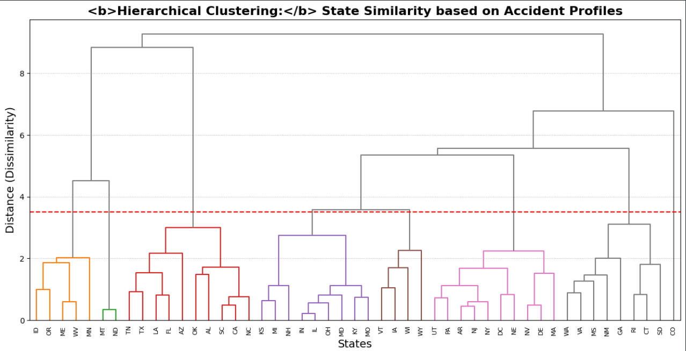

Ward-linkage hierarchical clustering groups all 49 US states by their multidimensional accident profile similarity. The red dashed threshold line at dissimilarity ~3.5 produces 7 meaningful policy clusters:

- 🟠 **ID, OR, ME, WV, MN:** Rural/Northern — winter weather, sparse infrastructure, low density
- 🔴 **TX, LA, TN, FL, AZ, SC, CA:** Sun Belt — warm climate, high-volume urban corridors
- 🟣 **KS, MI, NH, IN, IL, OH, MD, KY:** Midwest/Mid-Atlantic industrial corridor
- 🟤 **IA, WI, WY, VT:** Sparse rural cluster with distinctive low-volume profiles
- 🩷 **UT, PA, AR, NJ, NY, DC, NE, NV, DE, MA:** Northeast/Mountain mixed urban
- ⚫ **WA, VA, MS, NM:** Southern/Western transitional states
- 🩶 **GA, RI, CT, SD, CO:** Diverse outlier group requiring broader classification criteria

This enables **policy grouping** — states within a cluster can share intervention frameworks rather than developing independent strategies from scratch.

---

### 11. Temporal Ridgeline Analysis — Accident Hour Distribution by Weather

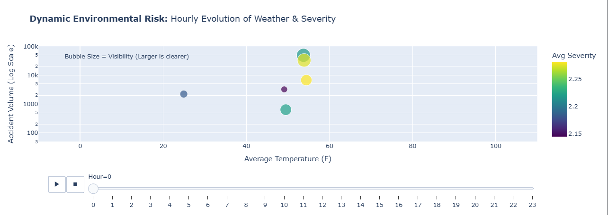

Ridgeline (joy) plots stack KDE distributions for each weather type, enabling direct visual comparison of accident timing across conditions. The divergences are sharp and policy-relevant:

- **Clear & Cloudy (teal):** Classic bimodal distribution — two sharp peaks at 7–8 AM and 4–5 PM, perfectly aligned with commute windows
- **Rain (gray):** Similar bimodal shape but slightly suppressed — drivers reduce speed and frequency in rain
- **Fog (pink-gray):** Pronounced early-morning density shift — peak moves to 6–8 AM when fog forms, a distinct leading-edge risk window
- **Snow (red):** Dramatically **flattened, wider curve** — accidents distribute across the full day, reflecting the sustained difficulty of snow driving rather than commute-concentrated risk

---

### 12. Topographic Risk Map — 2D Contours of Accident Severity

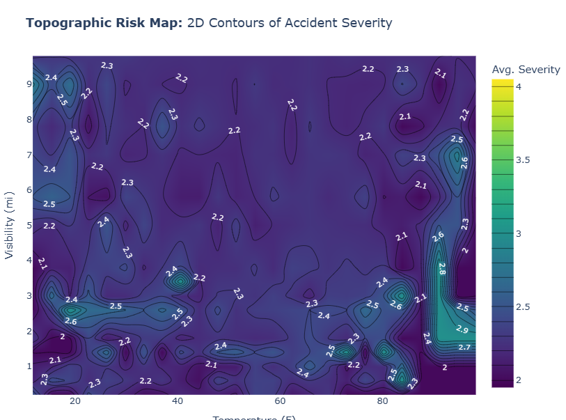

The most analytically sophisticated visualization in the suite. A 2D contour map plots **Temperature °F (x-axis) × Visibility in miles (y-axis) → Average Severity (color/z-axis)**. The non-linear, island-like contour shapes definitively disprove any simple linear relationship between environmental variables and severity.

Critical observations:
- **High visibility (>8 mi) + High temperature (>80°F) → Severity increases (2.5–2.9):** The "speed overconfidence" zone — clear, warm conditions encourage higher speeds, amplifying crash consequences
- **Low visibility (1–2 mi) + moderate temperature (20–40°F) → Severity 2.3–2.6:** Drivers measurably compensate behaviorally in poor conditions, partially offsetting the environmental hazard
- **Bottom-right corner (high temp, low visibility) → Severity spikes >2.9:** Heat haze, sun glare, and overconfidence create localized severity peaks

This surface is the foundation for a future risk-scoring model — any temperature/visibility combination can be mapped to an expected severity level.

---

## 🔑 Key Findings

### Finding 1 — The Infrastructure Paradox
> Complex intersections (signals, crossings, junctions) **increase** accident *frequency* but **decrease** accident *severity*. Open highway segments with no signals are statistically **deadlier** per accident. Signals enforce speed reduction and create predictable conflict zones.

### Finding 2 — Visibility vs. Volume (Counter-Intuitive)
> The *majority* of accidents (88%) occur in clear or cloudy conditions. Poor visibility is a stronger predictor of *fatal severity*, but good visibility enables the overconfidence and speed that generate the highest raw accident counts.

### Finding 3 — Human Schedule Dominates Environmental Signal
> Rush-hour commute timing explains more variance in accident frequency than any combination of weather variables. The daily accident curve mirrors human work schedules with a fidelity that environmental variables simply cannot match.

### Finding 4 — Midwest Severity Gap
> The Midwest hosts a unique risk profile: lower accident volume than coastal metros but significantly higher average severity per incident — consistent with rural high-speed road infrastructure, longer emergency response times, and variable winter conditions.

### Finding 5 — Regional Intervention Differentiation
> Hierarchical clustering reveals states group into meaningful policy clusters. Northeast interventions should target **congestion management**; Midwest strategies should prioritize **speed controls and weather early-warning systems**; Sun Belt policies should focus on **urban corridor design and lane discipline**.

---

## 🗂️ Project Structure

```
TrafficRisk-USA/
│
├── 📓 notebooks/
│   └── Traffic-Risk-USA-Pattern.ipynb      # Full analysis pipeline
│
├── 📊 visualizations/                      # All 12 exported chart images
│   ├── 01_heatmap_hour_vs_day.png
│   ├── 02_severity_zones_usa.png
│   ├── 03_weather_severity_breakdown.png
│   ├── 04_multidimensional_flow.png
│   ├── 05_correlation_matrix.png
│   ├── 06_top15_states_cities.png
│   ├── 07_hourly_env_trends.png
│   ├── 08_dynamic_env_risk.png
│   ├── 09_kmeans_hotspots.png
│   ├── 10_hierarchical_clustering.png
│   ├── 11_ridgeline_weather.png
│   └── 12_topographic_risk_map.png
│
├── 📄 paper/
│   └── DAV_IEEE_Paper.pdf                  # Full technical paper
│
├── requirements.txt
└── README.md
```

---

## 🛠️ Setup & Installation

### Prerequisites
- Python 3.10+
- Jupyter Notebook or JupyterLab
- ~8 GB RAM recommended for full dataset

### Installation

```bash
# Clone the repository
git clone https://github.com/zain31197/TrafficRisk-USA.git
cd TrafficRisk-USA

# Create virtual environment
python -m venv venv
source venv/bin/activate        # Linux/macOS
# venv\Scripts\activate         # Windows

# Install dependencies
pip install -r requirements.txt
```

### Requirements

```txt
pandas>=2.0.0
numpy>=1.24.0
matplotlib>=3.7.0
seaborn>=0.12.0
plotly>=5.14.0
scikit-learn>=1.3.0
scipy>=1.11.0
folium>=0.14.0
joypy>=0.2.6
jupyter>=1.0.0
```

---

## 🚀 Usage

### Running the Full Analysis

```bash
# Launch Jupyter
jupyter notebook notebooks/Traffic-Risk-USA-Pattern.ipynb
```

### Dataset Download

The dataset is not included due to size. Download from Kaggle:

```bash
# Install Kaggle CLI
pip install kaggle

# Download dataset
kaggle datasets download -d sobhanmoosavi/us-accidents
unzip us-accidents.zip -d data/
```

### Reproducing Individual Visualizations

Each visualization section in the notebook is modular and independently executable. Cell tags follow the format:
- `# VIZ_01` — Heatmap (Hour × Day)
- `# VIZ_09` — K-Means clustering map
- `# VIZ_10` — Hierarchical clustering dendrogram

---

## 📐 Technical Architecture

```
Raw CSV (7.7M rows)
       │
       ▼
┌─────────────────┐
│  Preprocessing  │  Missing value imputation, type casting, deduplication
└────────┬────────┘
         │
         ▼
┌─────────────────┐
│ Feature Eng.    │  Temporal decomposition, weather bucketing, hazard score
└────────┬────────┘
         │
         ├──────────────────┬──────────────────┬─────────────────┐
         ▼                  ▼                  ▼                 ▼
   Spatiotemporal      Statistical         Clustering        Network
    Analysis            Analysis            Analysis          Analysis
  (Heatmaps, KDE)   (Correlation,        (K-Means,        (Sankey Flow,
                     Ridgeline)          Hierarchical)     Alluvial)
         │                  │                  │                 │
         └──────────────────┴──────────────────┴─────────────────┘
                                    │
                                    ▼
                          12 Advanced Visualizations
                          + Policy Recommendations
```

---

## 📈 Metrics & Scale

| Metric | Value |
|--------|-------|
| Total Records Analyzed | ~7.7 Million |
| States Covered | 49 |
| Time Period | 2016–2023 (7 years) |
| Unique Cities | 11,000+ |
| Visualizations Produced | 12 |
| Clustering Configurations | K=2 to K=15 tested |
| Feature Variables | 15 core + 5 engineered |

---

## 🔮 Future Work

- [ ] **Real-Time Risk Scoring API** — REST endpoint scoring any lat/lng + time + weather combination against trained models
- [ ] **Predictive Severity Model** — XGBoost/LightGBM trained on all engineered features
- [ ] **Street-Level Analysis** — OpenStreetMap integration for road-type segmentation
- [ ] **Weather Forecast Integration** — NOAA forecast data for *prospective* risk window alerts
- [ ] **Interactive Dashboard** — Streamlit or Dash app for public exploration
- [ ] **Causal Inference** — Move beyond correlation using DoWhy or CausalML to identify true causal drivers

---

## 📬 Contact

**Zain Shahid**  
Data Scientist · Traffic Safety Analytics  
📧 [23i2582@isb.nu.edu.pk](mailto:23i2582@isb.nu.edu.pk)  
🔗 [GitHub](https://github.com/zain31197)

---

## 📄 License

This project is licensed under the MIT License. See [LICENSE](LICENSE) for details.

Dataset original source: [Moosavi, Sobhan, et al. "A Countrywide Traffic Accident Dataset." 2019](https://arxiv.org/abs/1906.05409)

---

<div align="center">

**If this project helped you understand road safety data better, consider leaving a ⭐**

*Built with the goal of turning accident statistics into lives saved.*

</div>
